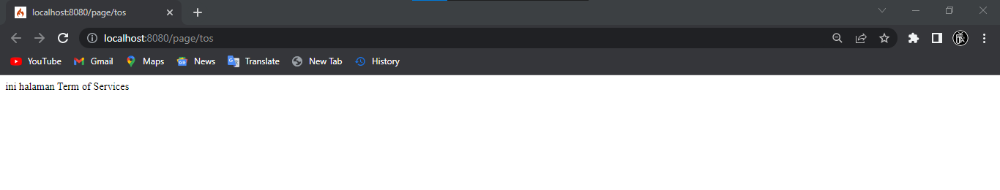

### NAMA    : MOH. TAUFIK RAUF
### NIM     : 312010151
### KELAS   : TI.20.A1

## Praktikum 11: PHP Framework (Codeigniter)
Tujuan
1. Mahasiswa mampu memahami konsep dasar Framework.
2. Mahasiswa mampu memahami konsep dasar MVC.
3. Mahasaswa mampu membuat program sederhana menggunakan Framework
Codeigniter 4.
Instruksi Praktikum
1. Persiapkan text editor misalnya VSCode.
2. Buat folder baru dengan nama lab11_php_ci pada docroot webserver (htdocs)
3. Ikuti langkah-langkah praktikum yang akan dijelaskan berikutnya.
Langkah-langkah Praktikum
Persiapan
Sebelum memulai menggunakan Framework Codeigniter, perlu dilakukan konfigurasi
pada webserver. Beberapa ekstensi PHP perlu diaktifkan untuk kebutuhan
pengembangan Codeigniter 4.
Berikut beberapa ekstensi yang perlu diaktifkan:
### • php-json ekstension untuk bekerja dengan JSON;
### • php-mysqlnd native driver untuk MySQL;
### • php-xml ekstension untuk bekerja dengan XML;
### • php-intl ekstensi untuk membuat aplikasi multibahasa;
### • libcurl (opsional), jika ingin pakai Curl.

#
### Untuk mengaktifkan ekstentsi tersebut, melalu XAMPP Control Panel, pada bagian Apache klik Config -> PHP.ini

Pada bagian extention, hilangkan tanda ; (titik koma) pada ekstensi yang akan
diaktifkan. Kemudian simpan kembali filenya dan restart Apache web server.


Instalasi Codeigniter 4
Untuk melakukan instalasi Codeigniter 4 dapat dilakukan dengan dua cara, yaitu cara
manual dan menggunakan composer. Pada praktikum ini kita menggunakan cara
manual.
• Unduh Codeigniter dari website https://codeigniter.com/download
• Extrak file zip Codeigniter ke direktori htdocs/lab11_ci.
• Ubah nama direktory framework-4.x.xx menjadi ci4.
• Buka browser dengan alamat http://localhost/lab11_ci/ci4/public/


## Menjalankan CLI (Command Line Interface)
Codeigniter 4 menyediakan CLI untuk mempermudah proses development. Untuk
mengakses CLI buka terminal/command prompt.


Arahkan lokasi direktori sesuai dengan direktori kerja project dibuat
(xampp/htdocs/lab11_ci/ci4/)
Perintah yang dapat dijalankan untuk memanggil CLI Codeigniter adalah:
```
php spark
```


Mengaktifkan Mode Debugging
Codeigniter 4 menyediakan fitur debugging untuk memudahkan developer untuk
mengetahui pesan error apabila terjadi kesalahan dalam membuat kode program.


Secara default fitur ini belum aktif. Ketika terjadi error pada aplikasi akan ditampilkan
pesan kesalahan seperti berikut.


Semua jenis error akan ditampilkan sama. Untuk memudahkan mengetahui jenis
errornya, maka perlu diaktifkan mode debugging dengan mengubah nilai konfigurasi
pada environment variable CI_ENVIRINMENT menjadi development.


Ubah nama file env menjadi .env kemudian buka file tersebut dan ubah nilai variable
CI_ENVIRINMENT menjadi development.


Ubah nama file env menjadi .env kemudian buka file tersebut dan ubah nilai variable
CI_ENVIRINMENT menjadi development.


Struktur Direktori
Untuk lebih memahami Framework Codeigniter 4 perlu mengetahui struktur direktori
dan file yang ada. Buka pada Windows Explorer atau dari Visual Studio Code ->
Open Folder.
Terdapat beberapa direktori dan file yang perlu dipahami fungsi dan kegunaannya.
• .github folder ini kita butuhkan untuk konfigurasi repo github, seperti konfigurasi
untuk build dengan github action;

• app folder ini akan berisi kode dari aplikasi yang kita kembangkan;

• public folder ini berisi file yang bisa diakses oleh publik, seperti file index.php,
robots.txt, favicon.ico, ads.txt, dll;

• tests folder ini berisi kode untuk melakukan testing dengna PHPunit;

• vendor folder ini berisi library yang dibutuhkan oleh aplikasi, isinya juga termasuk
kode core dari system CI.

• writalble foder ini berisi file yang ditulis oleh aplikasi. Nantinya, kita bisa pakai
untuk menyimpan file yang di-upload, logs, session, dll.
Sedangkan file-file yang berada pada root direktori CI sebagai berikut.

• .env adalah file yang berisi variabel environment yang dibutuhkan oleh aplikasi.

• .gitignore adalah file yang berisi daftar nama file dan folder yang akan diabaikan
oleh Git.

• build adalah script untuk mengubah versi codeigniter yang digunakan. Ada versi
release (stabil) dan development (labil).

• composer.json adalah file JSON yang berisi informasi tentang proyek dan daftar
library yang dibutuhkannya. File ini digunakan oleh Composer sebagai acuan.

• composer.lock adalah file yang berisi informasi versi dari libraray yang digunakan
aplikasi.

• license.txt adalah file yang berisi penjelasan tentang lisensi Codeigniter;

• phpunit.xml.dist adalah file XML yang berisi konfigurasi untuk PHPunit.

• README.md adalah file keterangan tentang codebase CI. Ini biasanya akan
dibutuhkan pada repo github atau gitlab.

• spark adalah program atau script yang berfungsi untuk menjalankan server,
generate kode, dll.


Fokus kita pada folder app, dimana folder tersebut adalah area kerja kita untuk
membuat aplikasi. Dan folder public untuk menyimpan aset web seperti css, gambar,
javascript, dll.

Memahami Konsep MVC
Codeigniter menggunakan konsep MVC. MVC meripakan singkatan dari
Model-View-Controller. MVC merupakan konsep arsitektur yang umum digunakan
dalam pengembangan aplikasi. Konsep MVC adalah memisahkan kode program
berdasarkan logic proses, data, dan tampilan. Untuk logic proses diletakkan pada
direktori Contoller, Objek data diletakkan pada direktori Model, dan desain tampilan
diletakkan pada direktori View.
Codeigniter menggunakan konsep pemrograman berorientasi objek dalam
mengimplementasikan konsep MVC.
Model merupakan kode program yang berisi pemodelan data. Data dapat berupa
database ataupun sumber lainnya.
View merupakan kode program yang berisi bagian yang menangani terkait tampilan
user interface sebuah aplikasi. didalam aplikasi web biasanya pasti akan berhubungan
dengan html dan css.
Controller merupakaan kode program yang berkaitan dengan logic proses yang
menghubungkan antara view dan model. Controller berfungsi untuk menerima request
dan data dari user kemudian diproses dengan menghubungkan bagian model dan view.
Routing dan Controller
Routing merupakan proses yang mengatur arah atau rute dari request untuk menentukan
fungsi/bagian mana yang akan memproses request tersebut. Pada framework CI4,
routing bertujuan untuk menentukan Controller mana yang harus merespon sebuah
request. Controller adalah class atau script yang bertanggung jawab merespon sebuah
request.
Pada Codeigniter, request yang diterima oleh file index.php akan diarahkan ke Router
untuk meudian oleh router tesebut diarahkan ke Controller.
Router terletak pada file app/config/Routes.php


Pada file tersebut kita dapat mendefinisikan route untuk aplikasi yang kita buat.
Contoh:
```
$routes->get('/', 'Home::index');
```

Kode tersebut akan mengarahkan rute untuk halaman home.
Membuat Route Baru.
Tambahkan kode berikut di dalam Routes.php
```
$routes->get('/about', 'Page::about');
$routes->get('/contact', 'Page::contact');
$routes->get('/faqs', 'Page::faqs');
```
Untuk mengetahui route yang ditambahkan sudah benar, buka CLI dan jalankan
perintah berikut.
```
php spark routes
```


Selanjutnya coba akses route yang telah dibuat dengan mengakses alamat url
http://localhost:8080/about


Ketika diakses akan mucul tampilan error 404 file not found, itu artinya file/page
tersebut tidak ada. Untuk dapat mengakses halaman tersebut, harus dibuat terlebih
dahulu Contoller yang sesuai dengan routing yang dibuat yaitu Contoller Page.

## Membuat Controller
Selanjutnya adalah membuat Controller Page. Buat file baru dengan nama page.php
pada direktori Controller kemudian isi kodenya seperti berikut.

```
<?php

namespace App\Controllers;

class Page extends BaseController
{
    public function about()
    {
        echo "Ini halaman About";
    }
    
    public function contact()
    {
        echo "Ini halaman Contact";
    }

    public function faqs()
    {
        echo "Ini halaman FAQ";
    }
}
```
Selanjutnya refresh Kembali browser, maka akan ditampilkan hasilnya yaotu halaman
sudah dapat diakses.

 

Auto Routing
Secara default fitur autoroute pada Codeiginiter sudah aktif. Untuk mengubah status
autoroute dapat mengubah nilai variabelnya. Untuk menonaktifkan ubah nilai true
menjadi false.

```
$routes->setAutoRoute(true);
```

Tambahkan method baru pada Controller Page seperti berikut.
public function tos()
```
{
echo "ini halaman Term of Services";
}
```
Method ini belum ada pada routing, sehingga cara mengaksesnya dengan menggunakan
alamat: http://localhost:8080/page/tos
 
Membuat View
Selanjutnya adalam membuat view untuk tampilan web agar lebih menarik. Buat file
baru dengan nama about.php pada direktori view (app/view/about.php) kemudian isi
kodenya seperti berikut.
```
<!DOCTYPE html>
<html lang="en">
<head>
    <meta charset="UTF-8">
    <title><?= $title; ?></title>
</head>
<body>
    <h1><?= $title; ?></h1>
    <hr>
    <p><?= $content; ?></p>
</body>
</html>
```
Ubah method about pada class Controller Page menjadi seperti berikut:
```
public function about()
{
    return view('about', [
        'title' => 'Halaman Abot',
        'content' => 'Ini adalah halaman abaut yang menjelaskan tentang isi
halaman ini.'
    ]);
}
```
Kemudian lakukan refresh pada halaman tersebut.

Membuat Layout Web dengan CSS
Pada dasarnya layout web dengan css dapat diimplamentasikan dengan mudah pada
codeigniter. Yang perlu diketahui adalah, pada Codeigniter 4 file yang menyimpan asset
css dan javascript terletak pada direktori public.
Buat file css pada direktori public dengan nama style.css (copy file dari praktikum
lab4_layout. Kita akan gunakan layout yang pernah dibuat pada praktikum 4.

Kemudian buat folder template pada direktori view kemudian buat file header.php dan
footer.php
File app/view/template/header.php
```
<!DOCTYPE html>
<html lang="en">
<head>
<meta charset="UTF-8">
<title><?= $title; ?></title>
<link rel="stylesheet" href="<?= base_url('/style.css');?>">
</head>
<body>
<div id="container">
<header>
<h1>Layout Sederhana</h1>
</header>
<nav>
<a href="<?= base_url('/');?>" class="active">Home</a>
<a href="<?= base_url('/artikel');?>">Artikel</a>
<a href="<?= base_url('/about');?>">About</a>
<a href="<?= base_url('/contact');?>">Kontak</a>
</nav>
<section id="wrapper">
<section id="main">
```
File app/view/template/footer.php
```
</section>
<aside id="sidebar">
<div class="widget-box">
<h3 class="title">Widget Header</h3>
<ul>
<li><a href="#">Widget Link</a></li>
<li><a href="#">Widget Link</a></li>
</ul>
</div>
<div class="widget-box">
<h3 class="title">Widget Text</h3>
<p>Vestibulum lorem elit, iaculis in nisl volutpat, malesuada
tincidunt arcu. Proin in leo fringilla, vestibulum mi porta, faucibus felis.
Integer pharetra est nunc, nec pretium nunc pretium ac.</p>
</div>
</aside>
</section>
<footer>
<p>&copy; 2021 - Universitas Pelita Bangsa</p>
</footer>
</div>
</body>
</html>
```
Kemudian ubah file app/view/about.php seperti berikut.
```
<?= $this->include('template/header'); ?>
<h1><?= $title; ?></h1>
<hr>
<p><?= $content; ?></p>
<?= $this->include('template/footer'); ?>
```
Selanjutnya refresh tampilan pada alamat http://localhost:8080/about


---
---
# Praktikum 12: Framework Lanjutan (CRUD)
Tujuan
1. Mahasiswa mampu memahami konsep dasar Model.
2. Mahasiswa mampu memahami konsep dasar CRUD.
3. Mahasaswa mampu membuat program sederhana menggunakan Framework
Codeigniter 4.
Instruksi Praktikum
1. Persiapkan text editor misalnya VSCode.
2. Buka kembali folder dengan nama lab11_php_ci pada docroot webserver (htdocs)
3. Ikuti langkah-langkah praktikum yang akan dijelaskan berikutnya.
Langkah-langkah Praktikum
Persiapan.
Untuk memulai membuat aplikasi CRUD sederhana, yang perlu disiapkan adalah
database server menggunakan MySQL. Pastikan MySQL Server sudah dapat dijalankan
melalui XAMPP.
Membuat Database: Studi Kasus Data Artikel
## Membuat Database
```
CREATE DATABASE lab_ci4;
```
## Membuat Tabel
```
CREATE TABLE artikel (
id INT(11) auto_increment,
judul VARCHAR(200) NOT NULL,
isi TEXT,
gambar VARCHAR(200),
status TINYINT(1) DEFAULT 0,
slug VARCHAR(200),
PRIMARY KEY(id)
);
```
Konfigurasi koneksi database
Selanjutnya membuat konfigurasi untuk menghubungkan dengan database server.
Konfigurasi dapat dilakukan dengan du acara, yaitu pada file app/config/database.php
atau menggunakan file .env. Pada praktikum ini kita gunakan konfigurasi pada file .env.

Membuat Model
Selanjutnya adalah membuat Model untuk memproses data Artikel. Buat file baru pada
direktori app/Models dengan nama ArtikelModel.php

```
<?php
namespace App\Models;
use CodeIgniter\Model;
class ArtikelModel extends Model
{
protected $table = 'artikel';
protected $primaryKey = 'id';
protected $useAutoIncrement = true;
protected $allowedFields = ['judul', 'isi', 'status', 'slug', 'gambar'];
}
```

Membuat Controller
Buat Controller baru dengan nama Artikel.php pada direktori app/Controllers.
```
<?php
namespace App\Controllers;
use App\Models\ArtikelModel;
class Artikel extends BaseController
{
public function index()
{
        $title = 'Daftar Artikel';
        $model = new ArtikelModel();
        $artikel = $model->findAll();
        return view('artikel/index', compact('artikel', 'title'));
    }
}
```

Membuat View
Buat direktori baru dengan nama artikel pada direktori app/views, kemudian buat file
baru dengan nama index.php.
```
<?= $this->include('template/header'); ?>

<?php if($artikel): foreach($artikel as $row): ?>
<article class="entry">
    <h2<a href="<?= base_url('/artikel/' . $row['slug']);?>"><?=
$row['judul']; ?></a>
</h2>
    " alt="<?=
$row['judul']; ?>">
    <p><?= substr($row['isi'], 0, 200); ?></p>
</article>
<hr class="divider" />
<?php endforeach; else: ?>
<article class="entry">
    <h2>Belum ada data.</h2>
</article>
<?php endif; ?>

<?= $this->include('template/footer'); ?>
```

Selanjutnya buka browser kembali, dengan mengakses url http://localhost:8080/artikel

Belum ada data yang diampilkan. Kemudian coba tambahkan beberapa data pada
database agar dapat ditampilkan datanya.
```
INSERT INTO artikel (judul, isi, slug) VALUE
('Artikel pertama', 'Lorem Ipsum adalah contoh teks atau dummy dalam industri
percetakan dan penataan huruf atau typesetting. Lorem Ipsum telah menjadi
standar contoh teks sejak tahun 1500an, saat seorang tukang cetak yang tidak
dikenal mengambil sebuah kumpulan teks dan mengacaknya untuk menjadi sebuah
buku contoh huruf.', 'artikel-pertama'),
('Artikel kedua', 'Tidak seperti anggapan banyak orang, Lorem Ipsum bukanlah
teks-teks yang diacak. Ia berakar dari sebuah naskah sastra latin klasik dari
era 45 sebelum masehi, hingga bisa dipastikan usianya telah mencapai lebih
dari 2000 tahun.', 'artikel-kedua');
```
Refresh kembali browser, sehingga akan ditampilkan hasilnya.


Membuat Tampilan Detail Artikel
Tampilan pada saat judul berita di klik maka akan diarahkan ke halaman yang berbeda.
Tambahkan fungsi baru pada Controller Artikel dengan nama view().
```
    public function view($slug)
    {
        $model = new ArtikelModel();
        $artikel = $model->where([
            'slug' => $slug
            ])->first();
        // Menampilkan error apabila data tidak ada.
        if (!$artikel)
        {
            throw PageNotFoundException::forPageNotFound();
        }
        $title = $artikel['judul'];
        return view('artikel/detail', compact('artikel', 'title'));
    }
```
Membuat View Detail
Buat view baru untuk halaman detail dengan nama app/views/artikel/detail.php.
```
<?= $this->include('template/header'); ?>
<article class="entry">
    <h2><?= $artikel['judul']; ?></h2>
    " alt="<?=
$artikel['judul']; ?>">
    <p><?= $row['isi']; ?></p>
</article>

<?= $this->include('template/footer'); ?>
```

Membuat Routing untuk artikel detail
Buka Kembali file app/config/Routes.php, kemudian tambahkan routing untuk artikel
detail.

```
$routes->get('/artikel/(:any)', 'Artikel::view/$1');
```


Membuat Menu Admin
Menu admin adalah untuk proses CRUD data artikel. Buat method baru pada
Controller Artikel dengan nama admin_index().
```
    public function admin_index()
    {
        $title = 'Daftar Artikel';
        $model = new ArtikelModel();
        $artikel = $model->findAll();
        return view('artikel/admin_index', compact('artikel', 'title'));
    }
```
Selanjutnya buat view untuk tampilan admin dengan nama admin_index.php
```
<?= $this->include('template/admin_header'); ?>

<table class="table">
    <thead>
        <tr>
            <th>ID</th>
            <th>Judul</th>
            <th>Status</th>
            <th>AKsi</th>
        </tr>
    </thead>
    <tbody>
    <?php if($artikel): foreach($artikel as $row): ?>
    <tr>
        <td><?= $row['id']; ?></td>
        <td>
            <b><?= $row['judul']; ?></b>
            <p><small><?= substr($row['isi'], 0, 50); ?></small></p>
        </td>
        <td><?= $row['status']; ?></td>
        <td>
            <a class="btn" href="<?= base_url('/admin/artikel/edit/' .
$row['id']);?>">Ubah</a>
            <a class="btn btn-danger" onclick="return confirm('Yakin
menghapus data?');" href="<?= base_url('/admin/artikel/delete/' .
$row['id']);?>">Hapus</a>
        </td>
    </tr>
    <?php endforeach; else: ?>
    <tr>
        <td colspan="4">Belum ada data.</td>
    </tr>
    <?php endif; ?>
    </tbody>
    <tfoot>
        <tr>
            <th>ID</th>
            <th>Judul</th>
            <th>Status</th>
            <th>AKsi</th>
        </tr>
    </tfoot>
</table>

<?= $this->include('template/admin_footer'); ?>
```

Tambahkan routing untuk menu admin seperti berikut:
```
$routes->group('admin', function($routes) {
    $routes->get('artikel', 'Artikel::admin_index');
    $routes->add('artikel/add', 'Artikel::add');
    $routes->add('artikel/edit/(:any)', 'Artikel::edit/$1');
    $routes->get('artikel/delete/(:any)', 'Artikel::delete/$1');
});
```
Akses menu admin dengan url http://localhost:8080/admin/artikel


Menambah Data Artikel
Tambahkan fungsi/method baru pada Controller Artikel dengan nama add().
```
    public function add()
    {
        // validasi data.
        $validation = \Config\Services::validation();
        $validation->setRules(['judul' => 'required']);
        $isDataValid = $validation->withRequest($this->request)->run();
        if ($isDataValid)
        {
            $artikel = new ArtikelModel();
            $artikel->insert([
                'judul' => $this->request->getPost('judul'),
                'isi' => $this->request->getPost('isi'),
                'slug' => url_title($this->request->getPost('judul')),
            ]);
            return redirect('admin/artikel');
        }
        $title = "Tambah Artikel";
        return view('artikel/form_add', compact('title'));
    }
```
Kemudian buat view untuk form tambah dengan nama form_add.php
```
<?= $this->include('template/admin_header'); ?>

<h2><?= $title; ?></h2>
<form action="" method="post">
    <p>
        <input type="text" name="judul">
    </p>
    <p>
        <textarea name="isi" cols="50" rows="10"></textarea>
    </p>
    <p><input type="submit" value="Kirim" class="btn btn-large"></p>
</form>

<?= $this->include('template/admin_footer'); ?>
```


Mengubah Data
Tambahkan fungsi/method baru pada Controller Artikel dengan nama edit().
```
    public function edit($id)
    {
        $artikel = new ArtikelModel();

        // validasi data.
        $validation = \Config\Services::validation();
        $validation->setRules(['judul' => 'required']);
        $isDataValid = $validation->withRequest($this->request)->run();

        if ($isDataValid)
        {
            $artikel->update($id, [
                'judul' => $this->request->getPost('judul'),
                'isi' => $this->request->getPost('isi'),
            ]);
            return redirect('admin/artikel');
        }

        // ambil data lama
        $data = $artikel->where('id', $id)->first();
        $title = "Edit Artikel";
        return view('artikel/form_edit', compact('title', 'data'));
    }
    <?= $this->include('template/admin_header'); ?>

    <h2><?= $title; ?></h2>
    <form action="" method="post">
        <p>
            <input type="text" name="judul" value="<?= $data['judul'];?>" >
        </p>
        <p>
            <textarea name="isi" cols="50" rows="10"><?=
    $data['isi'];?></textarea>
        </p>
        <p><input type="submit" value="Kirim" class="btn btn-large"></p>
</form>

<?= $this->include('template/admin_footer'); ?>
```


Mengubah Data
Tambahkan fungsi/method baru pada Controller Artikel dengan nama edit().
```
    public function edit($id)
    {
        $artikel = new ArtikelModel();
        // validasi data.
        $validation = \Config\Services::validation();
        $validation->setRules(['judul' => 'required']);
        $isDataValid = $validation->withRequest($this->request)->run();

        if ($isDataValid)
        {
            $artikel->update($id, [
                'judul' => $this->request->getPost('judul'),
                'isi' => $this->request->getPost('isi'),
            ]);
            return redirect('admin/artikel');
        }

        // ambil data lama
        $data = $artikel->where('id', $id)->first();
        $title = "Edit Artikel";
        return view('artikel/form_edit', compact('title', 'data'));
        }
        <?= $this->include('template/admin_header'); ?>

        <h2><?= $title; ?></h2>
        <form action="" method="post">
        <p>
            <input type="text" name="judul" value="<?= $data['judul'];?>" >
        </p>
        <p>
            <textarea name="isi" cols="50" rows="10"><?=
    $data['isi'];?></textarea>
        </p>
        <p><input type="submit" value="Kirim" class="btn btn-large"></p>
</form>

<?= $this->include('template/admin_footer'); ?>
```


Menghapus Data
Tambahkan fungsi/method baru pada Controller Artikel dengan nama delete().
```
    public function delete($id)
    {
        $artikel = new ArtikelModel();
        $artikel->delete($id);
        return redirect('admin/artikel');
    }
```

---
---

# Praktikum 13: Framework Lanjutan (Modul Login)
Tujuan
1. Mahasiswa mampu memahami konsep dasar Auth dan Filter.
2. Mahasiswa mampu memahami konsep dasar Login System.
3. Mahasaswa mampu membuat modul login menggunakan Framework Codeigniter 4.
Instruksi Praktikum
1. Persiapkan text editor misalnya VSCode.
2. Buka kembali folder dengan nama lab11_php_ci pada docroot webserver (htdocs)
3. Ikuti langkah-langkah praktikum yang akan dijelaskan berikutnya.
Langkah-langkah Praktikum
Persiapan.
Untuk memulai membuat modul Login, yang perlu disiapkan adalah database server
menggunakan MySQL. Pastikan MySQL Server sudah dapat dijalankan melalui
XAMPP.

Membuat Tabel User
```
CREATE TABLE user (
id INT(11) auto_increment,
username VARCHAR(200) NOT NULL,
useremail VARCHAR(200),
userpassword VARCHAR(200),
PRIMARY KEY(id)
);
```
Membuat Model User
Selanjutnya adalah membuat Model untuk memproses data Login. Buat file baru pada
direktori app/Models dengan nama UserModel.php
```
<?php

namespace App\Models;

use CodeIgniter\Model;

class UserModel extends Model
{
    protected $table = 'user';
    protected $primaryKey = 'id';
    protected $useAutoIncrement = true;
    protected $allowedFields = ['username', 'useremail', 'userpassword'];
}
```

Membuat Controller User
Buat Controller baru dengan nama User.php pada direktori app/Controllers.
Kemudian tambahkan method index() untuk menampilkan daftar user, dan method
login() untuk proses login.

```
<?php

namespace App\Controllers;

use App\Models\UserModel;

class User extends BaseController
{
    public function index()
    {
        $title = 'Daftar User';
        $model = new UserModel();
        $users = $model->findAll();
        return view('user/index', compact('users', 'title'));
    }
    public function login()
    {
        helper(['form']);
        $email = $this->request->getPost('email');
        $password = $this->request->getPost('password');
        if (!$email)
        {
            return view('user/login');
        }
        $session = session();
        $model = new UserModel();
        $login = $model->where('useremail', $email)->first();
        if ($login)
        {
            $pass = $login['userpassword'];
            if (password_verify($password, $pass))
            {
                $login_data = [
                    'user_id' => $login['id'],
                    'user_name' => $login['username'],
                    'user_email' => $login['useremail'],
                    'logged_in' => TRUE,
                ];
                $session->set($login_data);
                return redirect('admin/artikel');
            }
            else
            {
                $session->setFlashdata("flash_msg", "Password salah.");
                return redirect()->to('/user/login');
            }
        }
        else
        {
            $session->setFlashdata("flash_msg", "email tidak terdaftar.");
            return redirect()->to('/user/login');
        }
    }
}
```

Membuat View Login
Buat direktori baru dengan nama user pada direktori app/views, kemudian buat file
baru dengan nama login.php.
```
<!DOCTYPE html>
<html lang="en">
<head>
    <meta charset="UTF-8">
    <title>Login</title>
    <link rel="stylesheet" href="<?= base_url('/style.css');?>">
</head>
<body>
    <div id="login-wrapper">
        <h1>Sign In</h1>
        <?php if(session()->getFlashdata('flash_msg')):?>
            <div class="alert alert-danger"><?=
session()->getFlashdata('flash_msg') ?></div>
        <?php endif;?>
        <form action="" method="post">
            <div class="mb-3">
                <label for="InputForEmail" class="form-label">Email
address</label>
                <input type="email" name="email" class="form-control"
id="InputForEmail" value="<?= set_value('email') ?>">
            </div>
            <div class="mb-3">
                <label for="InputForPassword"
class="form-label">Password</label>
                <input type="password" name="password"
class="form-control" id="InputForPassword">
            </div>
            <button type="submit" class="btn
btn-primary">Login</button>
        </form>
    </div>
</body>
</html>
```

Membuat Database Seeder
Database seeder digunakan untuk membuat data dummy. Untuk keperluan ujicoba modul
login, kita perlu memasukkan data user dan password kedaalam database. Untuk itu buat
database seeder untuk tabel user. Buka CLI, kemudian tulis perintah berikut:

```
php spark make:seeder UserSeeder
```
Selanjutnya, buka file UserSeeder.php yang berada di lokasi direktori
/app/Database/Seeds/UserSeeder.php kemudian isi dengan kode berikut:
```
<?php

namespace App\Database\Seeds;

use CodeIgniter\Database\Seeder;

class UserSeeder extends Seeder
{
    public function run()
    {
        $model = model('UserModel');
        $model->insert([
            'username' => 'admin',
            'useremail' => 'admin@email.com',
            'userpassword' => password_hash('admin123', PASSWORD_DEFAULT),
        ]);
    }
}
```

Selanjutnya buka kembali CLI dan ketik perintah berikut:
```
php spark db:seed UserSeeder
```
Uji Coba Login
Selanjutnya buka url http://localhost:8080/user/login seperti berikut:


Menambahkan Auth Filter
Selanjutnya membuat filer untuk halaman admin. Buat file baru dengan nama Auth.php
pada direktori app/Filters.
```
<?php namespace App\Filters;

use CodeIgniter\HTTP\RequestInterface;
use CodeIgniter\HTTP\ResponseInterface;
use CodeIgniter\Filters\FilterInterface;

class Auth implements FilterInterface
{
    public function before(RequestInterface $request, $arguments = null)
    {
        // jika user belum login
        if(! session()->get('logged_in')){
            // maka redirct ke halaman login
            return redirect()->to('/user/login');
        }
    }
    public function after(RequestInterface $request, ResponseInterface
$response, $arguments = null)
    {
        // Do something here
    }
}
```

Selanjutnya buka file app/Config/Filters.php tambahkan kode berikut:
```
'auth' => App\Filters\Auth::class
```


Selanjutnya buka file app/Config/Routes.php dan sesuaikan kodenya.


Percobaan Akses Menu Admin
Buka url dengan alamat http://localhost:8080/admin/artikel ketika alamat tersebut
diakses maka, akan dimuculkan halaman login.


Fungsi Logout
Tambahkan method logout pada Controller User seperti berikut:
```
    public function logout()
    {
    session()->destroy();
    return redirect()->to('/user/login');
    }
```

---
---

# Praktikum 14: Pagination dan Pencarian

Membuat Pagination
Pagination merupakan proses yang digunakan untuk membatasi tampilan yang panjang
dari data yang banyak pada sebuah website. Fungsi pagination adalah memecah
tampilan menjadi beberapa halaman tergantung banyaknya data yang akan ditampilkan
pada setiap halaman.
Pada Codeigniter 4, fungsi pagination sudah tersedia pada Library sehingga cukup
mudah menggunakannya.
Untuk membuat pagination, buka Kembali Controller Artikel, kemudian modifikasi
kode pada method admin_index seperti berikut.

```
    public function admin_index()
    {
        $title = 'Daftar Artikel';
        $model = new ArtikelModel();
        $data = [
            'title' => $title,
            'artikel' => $model->paginate(10), #data dibatasi 10 record per
halaman
            'pager' => $model->pager,
        ];
        return view('artikel/admin_index', $data);
    }
```

Kemudian buka file views/artikel/admin_index.php dan tambahkan kode berikut
dibawah deklarasi tabel data.

```
<?= $pager->links(); ?>
```

Selanjutnya buka kembali menu daftar artikel, tambahkan data lagi untuk melihat
hasilnya.

